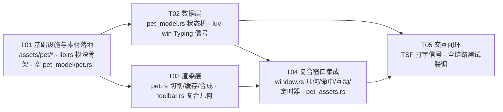

# M1 桌宠骨架 · 实施步骤任务书（M1-IMPLEMENTATION）

> 生成日期：2026-08-29
> 状态：Phase 1 门禁后、M1 开工前
> 基于：PRD v1.0 / ARCHITECTURE v1.0 / UIUX v1.0 + 现有代码摸底（toolbar.rs / render.rs / window.rs / toolbar_icons.rs / codec.rs 等）
> 范围锁定：**只做 M1 桌宠骨架**——宠物挂工具栏（同窗，居中挂工具栏正上方）、随四态（中英/全半角/简繁/标点/打字）状态驱动动画、基础互动（点击、拖拽复用）、1 只默认宠物、空闲停帧低功耗（30fps、<256px 精灵）。
> **明确不做**：M2 Lua 沙箱（iuv-pet-runtime crate）、M3 Steamworks 上架、宠物脱离工具栏独立放置、多宠同屏。

---

## 0. 结论摘要（给工程师的一页速览）

- **零新依赖**：M1 全部复用现有栈（tiny-skia 0.12 自带 `Pixmap::decode_png` + `draw_pixmap` 缩放；`include_bytes!` 内嵌素材；windows-rs 消息泵现成）。
- **5 个实现任务**（T01→T05），按依赖排序，全部在现有文件上演进。
- **默认宠素材推荐：CC0「Kitty」（CazBee, itch.io）**——32×32 精灵、单张精灵帧表、每动画一行（idle 8 帧 / walk 4 / jump 2 / fall 2，左右各一套）；CC0 公有领域，可嵌入闭源商业软件、可任意修改、零署名义务。备选：OpenGameArt CC0 猫/狗帧表。
- **动画状态机放 `iuv-core`（纯逻辑、无 I/O、可单测）**；渲染放 `iuv-ui/src/pet.rs`；复合窗口扩展在 daemon `toolbar/window.rs`。
- **打字信号**：新增 `ToolbarSignal::Typing`（tag `0x24`），TSF 组合开始/结束发出；四态复用现有 `StateChanged` 路径。
- **硬性约定**：daemon 绝不 panic（失败降级+日志）；工具条线程独占宠物状态；空闲停帧（`KillTimer`，零 tick）。

---

## 1. 实施步骤任务书（文件清单 + 实现顺序）

### 1.1 新增 / 修改文件清单

| 路径 | 增/改 | 职责（一句话） |
|------|-------|----------------|
| `crates/iuv-core/src/pet_model.rs` | 新增 | 宠物动画状态机纯逻辑：PetClip/PetMotion/PetModel，无 I/O，可单测 |
| `crates/iuv-core/src/lib.rs` | 修改 | 注册 `pub mod pet_model;` + `pub use pet_model::{PetClip, PetModel, PetMotion};` |
| `crates/iuv-ui/src/pet.rs` | 新增 | 精灵帧切割（sprite sheet→Pixmap 序列）、帧缓存查找（含 clip 缺失回退）、宠物帧渲染、alpha 命中采样 |
| `crates/iuv-ui/src/toolbar.rs` | 修改 | 新增 `PET_*` 几何常量 + `CompositeSpec` + `render_composite`（工具栏 Surface 缓存 + 宠物帧合成） |
| `crates/iuv-ui/src/lib.rs` | 修改 | 导出 pet 模块与 composite 相关 API |
| `platforms/windows/iuv-win/src/ipc/msg.rs` | 修改 | `ToolbarSignal` 增 `Typing { pid, tid, active }` 变体 |
| `platforms/windows/iuv-win/src/ipc/codec.rs` | 修改 | 信号帧 tag `0x24` 编解码（`encode_signal`/`decode_signal`） |
| `platforms/windows/iuv-tsf/src/composition.rs` | 修改 | 组合开始/内容非空 → 发 `Typing{active=true}`；组合结束/提交/取消 → `Typing{active=false}`（经 `daemon_client` 信号通道） |
| `platforms/windows/iuv-tsf/src/com/text_service.rs` | 修改 | 在组合生命周期回调挂 Typing 信号发射点（具体回调由工程师按现有 composition 流程定位） |
| `platforms/windows/iuv-daemon/src/pet_assets.rs` | 新增 | `include_bytes!` 默认宠帧表 + 帧表布局常量 + `Pixmap::decode_png` + `slice_frames` → `PetSprites`（失败降级 None，不 panic） |
| `platforms/windows/iuv-daemon/src/toolbar/mod.rs` | 修改 | `BarEvent` 增 `TypingState { pid, tid, active }`；`handle_signal` 路由 `ToolbarSignal::Typing` |
| `platforms/windows/iuv-daemon/src/toolbar/window.rs` | 修改 | 复合窗口：宠物区几何、宠物命中、点击互动、拖拽复用、动画定时器、四态/打字接线、工具栏 Surface 缓存（脏区重绘） |
| `platforms/windows/iuv-daemon/src/main.rs` | 修改 | 启动装配：加载 `pet_assets` 并传入 `ToolbarHost::spawn`（与 icons 同批） |
| `assets/pet/default.png` | 新增 | 默认宠精灵帧表（CC0 Kitty 或其衍生，单帧 ≤256px、单表 ≤256KB） |
| `assets/pet/LICENSE.md` | 新增 | 素材许可记录（来源/作者/许可全文/商用与修改授权），版权合规必填 |
| `docs/pet/M1-IMPLEMENTATION.md` | 新增 | 本文档 |

> 注：帧表布局（frame_w/frame_h/行列数/每 clip 帧区间）以 **Rust const 内嵌**（`pet_assets.rs` 或 `pet.rs`），**不引入 toml 解析依赖**；M2 mod 素材格式再做外部描述文件。

### 1.2 实现顺序（有序、含依赖关系）

```
T01 项目基础设施与素材落地（素材 + 模块骨架 + 编译基线）
   ├──► T02 数据层：PetModel 状态机 + Typing 信号扩展
   ├──► T03 渲染层：pet.rs 帧切割/缓存/合成 + toolbar.rs 复合几何
   └──► T04 复合窗口集成（daemon：几何/命中/点击/拖拽/定时器/接线）← 依赖 T02+T03
             └──► T05 交互闭环：TSF 打字信号 + 全链路测试/联调验收 ← 依赖 T02+T04
```

**为什么这个顺序**：宠物状态机是纯逻辑（T02 可先单测，不依赖任何窗口代码）；渲染层（T03）只依赖 iuv-ui 内部；复合窗口（T04）是唯一"接线"任务，同时消费 T02/T03；TSF 打字信号（T05）放最后，因为 daemon 侧消费（T04）就绪后信号才有意义，且 T05 是跨进程链路，适合收尾联调。

### 1.3 任务依赖图



---

## 2. 四态联动数据流设计（核心）

### 2.1 数据流总览

```
TSF StateSync（mode/width/script/punct 变化）
    → ToolbarSignal::StateChanged{pid,tid,state}（现有路径，零改动）
    → BarEvent::StateChanged（FIFO + WM_APP_REFRESH，现有路径）
    → 实例表更新（现有）
    → PetModel.on_ime_state(state)   ← M1 新增：四态 → 动画状态机
    → PetModel 解析 clip/frame
    → render_composite（工具栏 Surface 缓存 + 宠物帧合成，脏区重绘）
    → ULW 上屏（现有 present 管道）

TSF 组合开始/结束（新增）
    → ToolbarSignal::Typing{pid,tid,active}（新 tag 0x24）
    → BarEvent::TypingState（新事件）
    → PetModel.on_typing(active) → Typing/Idle 切换
    → 动画定时器 SetTimer/KillTimer（空闲停帧）
    → render_composite → ULW 上屏
```

### 2.2 事件路径复用说明

| 事件 | 通道 | 改动 |
|------|------|------|
| 四态变化（中英/全半角/简繁/标点） | 现有 `StateChanged` 信号管道 → FIFO | **零改动**，只新增消费端（PetModel） |
| 打字中 | 新增 `ToolbarSignal::Typing` | iuv-win codec + msg 各一处；TSF 组合回调发信号；daemon `BarEvent::TypingState` |

信号帧格式（iuv-win `codec.rs` 现有约定）：

```
0x21 FocusGained  : u32 pid u32 tid 4×u8（ImeState）
0x22 FocusLost    : u32 pid u32 tid
0x23 StateChanged : u32 pid u32 tid 4×u8（ImeState）
0x24 Typing       : u32 pid u32 tid 1×u8（0=结束 1=开始）   ← M1 新增
```

解码沿用现有 `Reader` 严格边界（越界 → Err → 信号线程断连重连，daemon 不受影响）。

### 2.3 四态 → 宠物表现映射（M1 素材可行集）

| 输入法状态 | 宠物表现（UIUX 定义） | PetModel 产出 clip | M1 素材映射（Kitty CC0） |
|------------|----------------------|--------------------|--------------------------|
| 中文模式 | 打小键盘 | `Idle` | idle 帧（8 帧循环） |
| 英文模式 | 打盹偷瞄 | `ModeEn` | idle 帧降频/复用（素材缺"打盹"则回退 Idle，文档注明） |
| 全/半角切换 | 体型/影子变化 | `Width` | 复用 jump 2 帧一闪（素材缺则回退 Idle） |
| 简/繁切换 | 换装 | `Script` | 复用 jump 2 帧一闪（素材缺则回退 Idle） |
| 标点切换 | （UIUX 未单列） | `Punct` | 复用 jump 2 帧一闪（素材缺则回退 Idle） |
| 打字中 | 敲键盘动画 | `Typing` | walk 帧 4 帧快速循环（近似敲键律动；缺则回退 idle 跳帧） |
| 点击互动 | 跳一下 | `React` | jump 2 帧 |

> 设计要点：**模型与素材解耦**——模型产出逻辑 clip（M2 可扩展），渲染层 `PetSprites::frame(clip, idx)` 负责缺失回退（`clip` 缺 → `Idle`；Idle 也缺 → 返回 None，宠物不渲染、不 panic）。这样默认宠素材"缺哪个动作"都不影响状态机正确性，只是视觉上回退到 idle。

---

## 3. 动画状态机设计（PetModel 纯逻辑，可单测）

### 3.1 类型定义（`crates/iuv-core/src/pet_model.rs`）

```rust
/// 动作片段标识（M1 内置集；M2 起由 mod 素材描述扩展）。
/// 渲染层按此查帧；缺失自动回退 Idle。
#[derive(Clone, Copy, Debug, PartialEq, Eq, Hash)]
pub enum PetClip {
    Idle,    // 闲置（M1 = 静止帧 0，零 tick）
    Typing,  // 打字敲键盘
    React,   // 点击互动（跳/蹭，一次性）
    ModeCn,  // 中文模式形象
    ModeEn,  // 英文模式形象（打盹偷瞄）
    Width,   // 全半角切换一闪（一次性）
    Script,  // 简繁切换一闪（一次性）
    Punct,   // 标点切换一闪（一次性）
}

/// 动作层（稳定的"循环/静止"态 + 可打断的"一次性"态）。
#[derive(Clone, Copy, Debug, PartialEq, Eq)]
pub enum PetMotion {
    Idle,        // 静止（回退基底）
    Typing,      // 打字循环
    React,       // 点击互动（一次性，播完回 Idle/Typing）
    StateFlash,  // 四态切换一闪（一次性，播完回 Idle/Typing）
}

/// 状态机（纯逻辑：无 I/O、无时钟依赖；时间推进由外部喂 dt_ms）。
pub struct PetModel {
    look: ImeState,     // 当前四态（外观层；ImeState 即全仓唯一四态表示）
    motion: PetMotion,
    typing: bool,       // 打字中标志（一次性动作播完后的回退目标）
    frame: u32,         // 当前 clip 帧索引
    accum_ms: u32,      // 帧间隔累加器（advance 喂入）
    flash_kind: PetClip,// StateFlash 具体是哪个状态（Width/Script/Punct/Mode*）
    flash_left: u32,    // 一次性动作剩余帧
}

impl PetModel {
    pub fn new(initial: ImeState) -> Self;
    pub fn on_ime_state(&mut self, s: ImeState);   // 四态变化：仅字段实际变化时触发 Flash
    pub fn on_typing(&mut self, active: bool);     // 打字开始/结束
    pub fn on_click(&mut self);                     // 点击互动
    pub fn advance(&mut self, dt_ms: u32);          // 时间推进（clamp dt≤100ms 防休眠大跳帧）
    pub fn clip(&self) -> PetClip;                  // 当前解析 clip（渲染层查帧用）
    pub fn frame(&self) -> u32;                     // 当前帧
    pub fn needs_tick(&self) -> bool;               // false = 空闲停帧（外部 KillTimer）
}
```

### 3.2 迁移规则

| 当前 motion | 事件 | 新 motion | 说明 |
|-------------|------|-----------|------|
| Idle / Typing | `on_ime_state`（四态任一字段变化） | `StateFlash` | flash_left=8，flash_kind 取变化字段优先级 mode > script > width > punct |
| Idle / Typing | `on_typing(true)` | `Typing` | 打字循环 |
| Typing | `on_typing(false)` | `Idle` | 停打回静 |
| 任意 | `on_click` | `React` | flash_left=10；再次点击重置帧 |
| StateFlash | advance 播完（flash_left=0） | `typing ? Typing : Idle` | 回退稳定态 |
| React | advance 播完（flash_left=0） | `typing ? Typing : Idle` | 回退稳定态 |

- **clip 解析**：`StateFlash` → `flash_kind`；`Typing` → `PetClip::Typing`；`React` → `PetClip::React`；`Idle` → `look.mode == English ? PetClip::ModeEn : PetClip::Idle`。
- **帧率（模型内常量，M1）**：Idle/ModeEn 冻结（帧 0 静止）；Typing 12fps；React/StateFlash 10fps。`advance(dt)`：`accum_ms += min(dt, 100)`；`frame = accum_ms * fps / 1000`（取整）；一次性动作 `flash_left = total - frame`，`<=0` 触发回退。
- **空闲停帧**：`needs_tick() == false` 当且仅当 `motion ∈ {Idle}`（含 ModeEn 静态帧）。此时外部必须 `KillTimer`（零 tick，符合 ARCHITECTURE §7 性能目标）。

### 3.3 可单测点（T02 验收）

- 四态任一字段变化 → StateFlash，且 flash_kind 正确（mode 优先）；四态不变 → 不触发。
- on_typing(true/false) 在 Idle 与 Typing 间切换；打字中切四态 → Flash 播完回 Typing。
- on_click 打断任意动作 → React；播完回 typing 状态对应稳定态；连续点击重置。
- advance 帧推进与 fps 换算（1000ms/12fps ≈ 12 帧）；dt clamp（喂 10_000ms 不跳穿）。
- needs_tick：Idle 静止 false；Typing/React/StateFlash true。
- clip 解析：中文+Idle→Idle；英文+Idle→ModeEn；Typing→Typing。

---

## 4. 精灵帧渲染管线（pet.rs，iuv-ui）

### 4.1 管线五段

```
① include_bytes!(default.png) 内嵌帧表        （daemon pet_assets.rs，同 toolbar_icons 模式）
② Pixmap::decode_png → 单张 Pixmap            （tiny-skia 自带，零新依赖）
③ slice_frames(sheet, layout) → Vec<Pixmap>    （行优先切割；尺寸校验失败 → 空 Vec）
④ PetSprites::frame(clip, idx) 查帧缓存        （clip 缺失回退 Idle；越界 clamp 到 0）
⑤ render_pet_frame → 宠物区 Surface → render_composite 合成 → ULW 上屏
```

### 4.2 关键 API（iuv-ui）

```rust
// pet.rs
pub struct PetSheetLayout { pub frame_w: u32, pub frame_h: u32, pub rows: u32, pub cols: u32 }
pub fn slice_frames(sheet: &Pixmap, layout: &PetSheetLayout) -> Vec<Pixmap>;
//   校验：sheet.w % frame_w == 0 && sheet.h % frame_h == 0，否则返回空 Vec（不 panic）。

pub struct PetSprites {
    pub frames: Vec<Pixmap>,
    pub clips: HashMap<PetClip, Range<usize>>,   // 布局常量映射（pet_assets.rs 内嵌）
}
impl PetSprites {
    pub fn frame(&self, clip: PetClip, idx: u32) -> Option<&Pixmap>; // 缺 clip → Idle；越界 → 首帧
    pub fn clip_len(&self, clip: PetClip) -> u32;                    // 同上回退
}

pub fn render_pet_frame(
    canvas: &mut Pixmap,          // 宠物区画布（透明底）
    sprites: &PetSprites, clip: PetClip, frame: u32,
    dst: &LayoutRect,             // 目标显示矩形（已乘 scale）
) -> bool;                        // false = 素材缺失/分配失败（上层留空，不 panic）

pub fn pet_alpha_at(sprites: &PetSprites, clip: PetClip, frame: u32,
                    dst: &LayoutRect, px: f32, py: f32) -> u8;   // 命中测试：逆缩放采样精灵 alpha

// toolbar.rs 复合
pub const PET_OVERHANG: f32 = 136.0;   // 宠物栖木高度（工具栏上沿之上）
pub const PET_DISPLAY_W: f32 = 112.0;  // 宠物显示宽（少女半身像，非正方形）
pub const PET_DISPLAY_H: f32 = 128.0;  // 宠物显示高

pub struct PetRenderSpec<'a> { pub sprites: &'a PetSprites, pub clip: PetClip, pub frame: u32 }
pub struct CompositeSpec<'a> {
    pub toolbar: &'a ToolbarSpec<'a>,   // 复用现有 ToolbarSpec（icons/state/hover/pressed）
    pub pet: Option<&'a PetRenderSpec<'a>>,
}
pub fn render_composite(spec: &CompositeSpec, theme: &Theme, scale: f32)
    -> (Surface, Vec<LayoutRect>, Option<LayoutRect>);
//   返回：合成 Surface / 按钮矩形（已偏移进复合坐标）/ 宠物显示矩形（命中用）
```

### 4.3 帧率控制与脏区重绘（daemon 侧策略）

- **定时器**：`SetTimer(hwnd, PET_TIMER_ID, 33ms, NULL)`（≈30fps 上限）。`WM_TIMER` → `PetModel::advance(33)` → 若 `!needs_tick()` → `KillTimer`（空闲停帧，零 tick）。
- **脏区**：工具栏 Surface 缓存（`toolbar_cache: Option<Surface>`），仅在 hover/pressed/四态/主题变化时重渲染；动画 tick 只重渲宠物帧 + 合成（合成 = blit 缓存工具栏 + 新宠物帧），按钮区零重绘。
- **合成实现**：`render_composite` = 复用 `render_toolbar`（工具栏 Surface，BGRA）+ `render_pet_frame`（宠物区 Surface，透明底，BGRA）+ Surface 级像素拷贝合成（premultiplied BGRA，alpha>0 直接覆盖；工具栏不透明白底覆盖、宠物半透明像素拷贝到透明底上，正确）。合成尺寸 `(max(toolbar_w, 宠物显示宽), toolbar_h + PET_OVERHANG)`——宠物居中挂在工具栏正上方，宽度不追加。
- **上屏**：沿用现有 `present`（`ulw.upload`），窗口尺寸在首次 show 后恒定（动画只变像素，不变几何）。

### 4.4 帧表布局常量（默认宠，Kitty CC0 示例）

```rust
// daemon pet_assets.rs 内嵌（Rust const，不引入 toml）
const DEFAULT_SHEET: &[u8] = include_bytes!(asset!("pet/default.png"));
const DEFAULT_LAYOUT: PetSheetLayout = PetSheetLayout { frame_w: 32, frame_h: 32, rows: 8, cols: 8 };
// clips 映射（行 = 动画）：row0 idle_left(8) → Idle；row4 idle_right(8) → Idle（取 row0）；
// row2/row6 jump(2) → React/Width/Script/Punct；row1/row5 walk(4) → Typing；ModeEn → 回退 Idle
fn default_clips() -> HashMap<PetClip, Range<usize>> { /* 编译期常量表 */ }
```

---

## 5. 复合窗口几何（daemon toolbar/window.rs）

### 5.1 几何数值（@96dpi 基准，render 乘 scale 后 ceil）

| 量 | 公式 | 值（scale=1） |
|----|------|---------------|
| 工具栏宽 | `btn*6 + gap*5 + pad*2`（现有） | 212 |
| 工具栏高 | `btn + pad*2`（现有） | 42 |
| 栖木高度 | `PET_OVERHANG` | 136 |
| 宠物显示宽/高 | `PET_DISPLAY_W / PET_DISPLAY_H`（少女半身像） | 112 / 128 |
| 复合窗宽 | `max(212, 112)` = 工具栏宽（宠物居中挂上方，不追加宽度） | 212 |
| 复合窗高 | `42 + 136` | 178 |
| 工具栏区原点 | `(0, PET_OVERHANG)` | (0, 136) |
| 宠物显示矩形 | `x = (212-112)/2, y = 136-128, w/h = 112/128` | (50, 8, 112, 128) |

> 宠物底边 y=136 = 工具栏上沿（栖木线）：视觉上"趴在上沿"，符合 UIUX §4.1 栖木式吸附。
> 宠物**水平居中于工具栏**（非右侧追加区）——2026-08-30 改：旧版宠物挂在工具栏右侧
> 128 px 追加区，复合窗比工具栏宽一截，工具栏拖不到屏幕右边缘。宠物区背景透明
> （alpha=0），仅宠物像素不透明。

### 5.2 命中测试扩展（WM_NCHITTEST）

```
新判定顺序：
1. 点在宠物显示矩形内 且 pet_alpha_at() > 0x20      → HTCLIENT（可点击/拖拽）
2. 点在工具栏背景圆角矩形（0, overhang, toolbar_w, toolbar_h）内 → HTCLIENT（现有 in_rounded_rect）
3. 其余（宠物区透明像素、圆角外、工具栏右侧空隙）  → HTTRANSPARENT（点击穿透）
```

- 按钮矩形：`render_composite` 返回的按钮矩形**已偏移进复合坐标**（y += PET_OVERHANG），`hit_test` 直接复用（现有逻辑零改动）。
- 鼠标悬停光标：现有 `WM_SETCURSOR` 逻辑保持不变（按钮手指头 / 其余箭头）；宠物区加"手型"可选（P2）。

### 5.3 点击与拖拽（复用现有拖拽管线）

| 事件 | 行为 |
|------|------|
| `WM_LBUTTONDOWN` 在宠物命中区 | `pet_down = Some((光标屏幕坐标, 宠物矩形))` + `SetCapture`；**不立即拖拽**（点击/拖拽判别） |
| `WM_MOUSEMOVE`（pet_down 存在）且位移 > 4px | 转为拖拽：`pet_down = None`，`start_drag_at(按下点)`（复用现有 drag_offset 语义） |
| `WM_LBUTTONUP`（未发生拖拽） | `PetModel::on_click()`（React 动画） |
| `WM_LBUTTONUP`（拖拽中） | `end_drag()`（现有：clamp 回工作区 + 持久化） |
| 工具栏空白/logo 拖拽 | 现有逻辑，零改动 |

> 备选简化（若工程师嫌判别复杂）：宠物按下即 `on_click() + start_drag()`——点击立刻有反应、同时可拖。两者皆可，**推荐判别版**（体验更佳），单测覆盖 `pet_down→drag` 阈值转换。

### 5.4 动画定时器生命周期

- `show()` / `apply_event(StateChanged/TypingState/on_click)` 后：若 `pet.needs_tick()` → `SetTimer(33ms)`。
- `WM_TIMER`：`pet.advance(33)` → 若 `!needs_tick()` → `KillTimer`；然后合成上屏。
- `hide()` / `FocusLost` / `WM_DESTROY`：**必须先 `KillTimer`**（防定时器在窗口销毁后触发，触碰已释放的 ToolbarWindow）。
- 切换 focused 实例：重置 PetModel（`PetModel::new(新实例四态)`）+ KillTimer + 重绘。

---

## 6. 测试要点

| 层 | 可单测函数/模块 | 用例 |
|----|-----------------|------|
| iuv-core `pet_model.rs` | `PetModel::on_ime_state/on_typing/on_click/advance/clip/needs_tick` | §3.3 全部（纯逻辑，无 I/O，`cargo test -p iuv-core`） |
| iuv-ui `pet.rs` | `slice_frames` | 尺寸合法 → 帧数=rows×cols；尺寸不整除 → 空 Vec；空 sheet → 空 Vec |
| iuv-ui `pet.rs` | `PetSprites::frame/clip_len` | 缺 clip 回退 Idle；越界 clamp 首帧；全缺 → None |
| iuv-ui `pet.rs` | `render_pet_frame` | 素材缺失返回 false 不 panic；正常帧在目标矩形中心非透明、四角透明 |
| iuv-ui `pet.rs` | `pet_alpha_at` | 中心 alpha>阈值、透明角 alpha≈0 |
| iuv-ui `toolbar.rs` | `render_composite` | 合成尺寸=公式值；按钮矩形已偏移（y≥overhang）；宠物矩形落在窗内；无 pet 时=纯工具栏且无宠物矩形 |
| iuv-win `codec.rs` | `encode_signal/decode_signal` | tag 0x24 往返一致；未知 tag → Err；短载荷 → Err |
| daemon `window.rs` | 命中判定（纯函数化） | 宠物像素点→可交互；透明点→穿透；工具栏按钮命中不变 |
| daemon 定时器 | 状态机 + Timer 联动（可抽纯函数） | needs_tick false → KillTimer；true → SetTimer |

> 建议：把 `hit_pet(x, y)` 与"点击/拖拽判别"抽成纯函数（输入坐标/阈值/宠物 alpha → 输出行为），便于单测；daemon 全部新函数沿用"失败降级不 panic"约定。

---

## 7. 免费许可桌宠素材调研结论（已上网核实，2026-08-29）

### 7.1 候选清单

| # | 候选 | 来源链接 | 许可证全称 | 作者 | 素材形式 | 可商用 | 可修改 |
|---|------|----------|------------|------|----------|--------|--------|
| 1 | **Kitty（推荐）** | https://caz-bee.itch.io/kitty | Creative Commons Zero v1.0 Universal（CC0） | CazBee | 32×32 像素猫；8 组动画：idle 8 帧 / walk 4 / jump 2 / fall 2（左、右各一套）；单张精灵帧表、每动画一行；附 .aseprite 源文件 | ✅ 无限制 | ✅ 无限制（页面作者确认 "do whatever you want"） |
| 2 | Cat sprites | https://opengameart.org/node/21390 | CC0 1.0（页面标注 License(s): CC0，作者声明无需署名） | Shepardskin | 猫精灵 + GIF（walk/run 及 x2/x4 放大版） | ✅ 无限制 | ✅ 无限制 |
| 3 | Dog Spritesheets | https://opengameart.org/content/dog-spritesheets | CC0 1.0（页面标注 CC0） | Jason of GDN | 像素狗帧表：idle / walk / run / jump / fall / attack；黑/白/棕 3 色 | ✅ 无限制 | ✅ 无限制 |
| 4 | Shimeji-ee 默认角色帧集 | https://github.com/gil/shimeji-ee（`img/Shimeji/`，shime1-46.png） | BSD-2-Clause 风格（Shimeji-ee Group）+ Kilkakon 署名请求（非强制条款） | Yuki Yamada（Group Finity）原作 / Shimeji-ee Group | 46 帧 × 128×128：桌宠全套动作（闲置/行走/攀爬/掉落/分裂），专为桌宠设计 | ✅（二进制再分发须保留版权声明；建议致谢） | ✅（须保留声明） |
| 5 | Cat 2D Pixel Art | https://xzany.itch.io/cat-2d-pixel-art | 自定义宽松许可：个人/商业可用、可改，禁转售素材本体、禁 NFT | Mattz Art | 32×32；14 组动画：idle 8 / sleep 8 / eat 7 / lick 15 / scare 11 等 | ✅ | ✅（禁转售/NFT） |
| 6 | Pixel Animated Cats | https://ivoryred.itch.io/animated-cats | CC-BY 4.0 International（需署名；购买/捐赠后免署名） | IvoryRed | 23×17 猫：idle / walk / jump / meow / sleep / touch / sit idle | ✅（需署名） | ✅ |

### 7.2 推荐默认宠：**Kitty（CazBee, CC0）**

理由：

1. **许可最纯净**：CC0 = 公有领域奉献，可嵌入闭源商业软件（iuv-daemon 闭源上 Steam）、可任意修改（含换色/加键盘姿势）、零署名义务、零 copyleft 传染。直接规避 Shimeji-ee 的 BSD 声明保留义务与社区包的许可不明问题。
2. **帧表适配性**：单张 sprite sheet、每动画一行 → 正好对应本设计"行 = clip"的切割模型；`idle_left(8)` 天然作 Idle 循环、`jump(2)` 作 React/四态一闪、`walk(4)` 作 Typing 敲键律动（素材可行集已在 §2.3 映射）。
3. **约束匹配**：32×32 精灵，远小于 <256px 约束；整表 3.6KB，内嵌体积可忽略；像素风与 Bongo Cat 系桌宠定位一致。
4. **作者明确授权**：页面许可 CC0 + 评论区作者确认 "do whatever you want with it :3"。

### 7.3 版权红线提示

- **优先 CC0**；CC-BY（署名）可接受但必须在 about/credits 声明；BSD-2 可接受但须保留版权声明；**自定义许可逐条核对**（转售/NFT 禁令在素材内嵌进应用后不构成冲突，但仍需留档）。
- **Shimeji 社区角色包（shimejis.xyz、fandom 等）多为粉丝同人**，角色本身版权归原 IP 方，许可不明/可能侵权——**禁止直接商用嵌入**；仅可参照其帧格式（开放格式）。
- 落地合规：`assets/pet/LICENSE.md` 必须记录来源 URL + 作者 + 许可全文 + 商用/修改授权；若对 Kitty 做衍生（换色/加姿势），基于 CC0 合法，且建议在 credits 致谢作者（非义务）。
- 若未来默认宠需要"四态专用"动作（打盹、换装、敲键盘），推荐**在 CC0 基础上请画师衍生**（CC0 允许），或内部原创（最干净）。

---

## 8. 风险点与对策

| # | 风险 | 影响 | 对策 |
|---|------|------|------|
| 1 | **素材嵌入体积** | exe 体积增长、编译慢 | 单帧 ≤256px、单表 ≤256KB、总帧 ≤64（加载时校验，超限降级 None）；默认宠 Kitty 表仅 3.6KB，影响可忽略；M2 起 mod 素材走外部目录（`%LOCALAPPDATA%\iuv\mods\`）不再内嵌 |
| 2 | **帧表解析** | 帧错位/越界 → 画面错乱或 panic | `slice_frames` 强校验（尺寸整除、行列为 0 → 空 Vec）；`frame()` 越界 clamp；所有路径不 panic |
| 3 | **四态联动边界** | 高频切换 → Flash 反复打断；多实例切换 → 宠物状态串扰 | `on_ime_state` 仅字段实际变化触发；Flash/React 播完回稳定态；**仅 focused 实例驱动宠物**；FocusLost/hide 重置模型 |
| 4 | **daemon 稳定性** | 定时器生命周期泄漏/悬挂 → 崩溃或高占用 | `KillTimer` 严格配对（hide/destroy/切实例）；WM_TIMER 回调全防御（hwnd 有效 + pet 存在才动）；`advance` clamp dt 防休眠大跳帧；素材解码失败 → 宠物区留空、工具栏不受影响 |
| 5 | **打字信号时序** | 组合中断/切窗口时 Typing 卡死 | Typing 信号带 pid:tid 校验（仅 focused 生效）；FocusLost/隐藏强制回 Idle；TSF 在 OnEndComposition/取消时必发 active=false |
| 6 | **素材许可合规** | 上 Steam 后被版权方投诉 | 只采用 CC0/CC-BY/BSD-2/明确自定义许可并留档（`assets/pet/LICENSE.md`）；社区同人包一律不用；工坊 UGC 版权条款在 M3 落地 |
| 7 | **性能** | 动画 tick 影响打字热路径 | 空闲停帧（零 tick）；脏区重绘（工具栏缓存）；30fps 上限；动画仅在宠物区合成，不触碰候选窗渲染管道 |

---

## 9. 共享约定（Shared Knowledge）

- **daemon 硬性约定"绝不 panic"**：新代码全部 `Option`/`Result` + 静默降级 + `log::log_line` 记录；素材/分配失败绝不 panic。
- **零新依赖白名单**：M1 不新增任何第三方 crate（tiny-skia 自带 PNG 解码与缩放；布局常量 Rust const 内嵌，不引入 toml）。
- **Surface = premultiplied BGRA**（u32 对齐、无 stride）；tiny-skia Pixmap = premultiplied RGBA——渲染管线内交换每像素 R/B；合成也在 BGRA 空间做像素拷贝。
- **ImeState 是全仓唯一四态表示**（`iuv-core/src/config/runtime.rs`，字段序 mode/width/script/punct，`Clone + Copy`）；线编码 `[u8;4]`；加"打字"不并入 ImeState（是事件非状态），走独立 Typing 信号。
- **信号帧格式**：`0x21` FocusGained / `0x22` FocusLost / `0x23` StateChanged / `0x24` Typing（新增）。
- **工具栏几何常量**：`TOOLBAR_BTN=30 / GAP=4 / PAD=6 / TB_COUNT=6`（@96dpi 基准，render 乘 scale）；宠物常量 `PET_OVERHANG=136 / PET_DISPLAY_W=112 / PET_DISPLAY_H=128`（2026-08-30 起删 `PET_ZONE_W`：宠物改挂工具栏正上方居中）。
- **线程模型**：工具条线程独占 `ToolbarWindow` 全部状态（含 PetModel/PetSprites/定时器）；跨线程仅经 FIFO（`BarEvent`）+ `PostMessage(WM_APP_REFRESH)`；宠物状态零跨线程共享、零锁竞争。
- **资产内嵌宏**：`asset!($f) = concat!(env!("CARGO_MANIFEST_DIR"), "/../../../assets/", $f)`（daemon 与 iuv-ui 均适用）。
- **素材合规**：`assets/pet/LICENSE.md` 必填（来源/作者/许可/商用修改授权）；默认宠 CC0。

---

## 10. 验收标准（M1 出口，对齐 ARCHITECTURE §8）

- [ ] 宠物挂工具栏正上方居中、栖木式吸附（底边贴工具栏上沿），与 6 按钮热区互不遮挡；复合窗宽 = 工具栏宽（工具栏可拖到屏幕右边缘）。
- [ ] 中英/全半角/简繁/标点切换有对应动画反馈（含缺素材回退不 panic）；打字中有 Typing 动画、停打回 Idle。
- [ ] 点击宠物触发互动动画；宠物可拖拽移动整个复合窗口并持久化位置。
- [ ] 空闲停帧（无定时器 tick）；动画 ≤30fps；常驻 CPU 增量 <1%（空闲时）。
- [ ] 素材许可记录（LICENSE.md）齐全；M1 零新依赖；daemon 全路径不 panic。
- [ ] `cargo test -p iuv-core -p iuv-ui` 通过（pet_model / pet / codec 新测试全绿）。

---

## 11. 变更记录

| 日期 | 变更内容 | 原因 | 影响范围 |
|------|----------|------|----------|
| 2026-08-29 | v1.0 初版 | Phase 1 门禁后 M1 开工前 | — |
